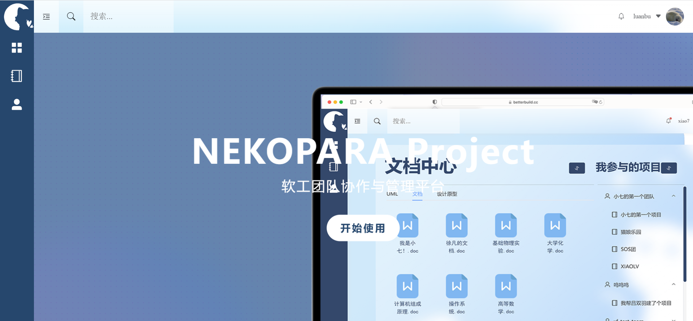
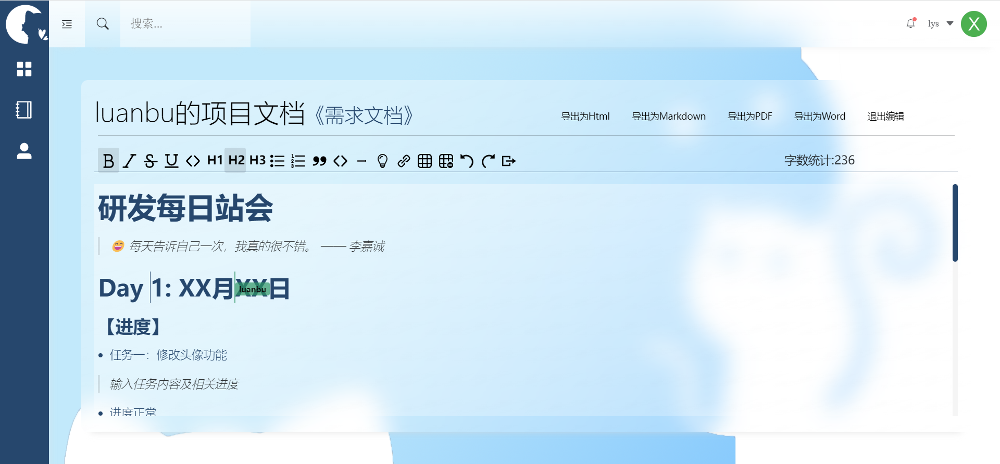
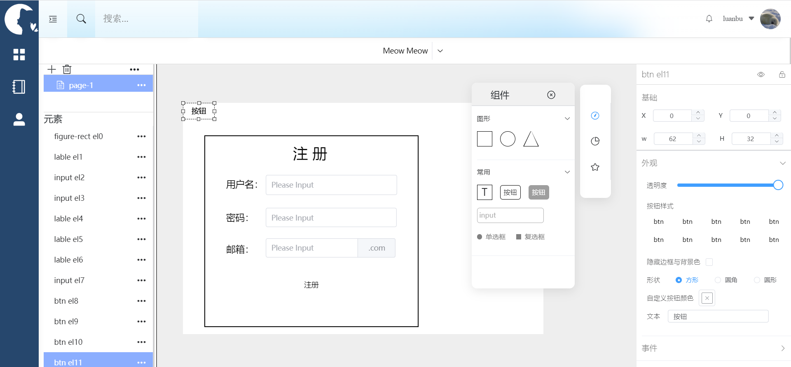
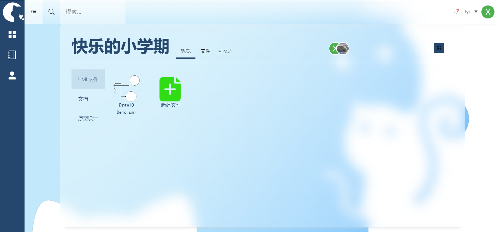
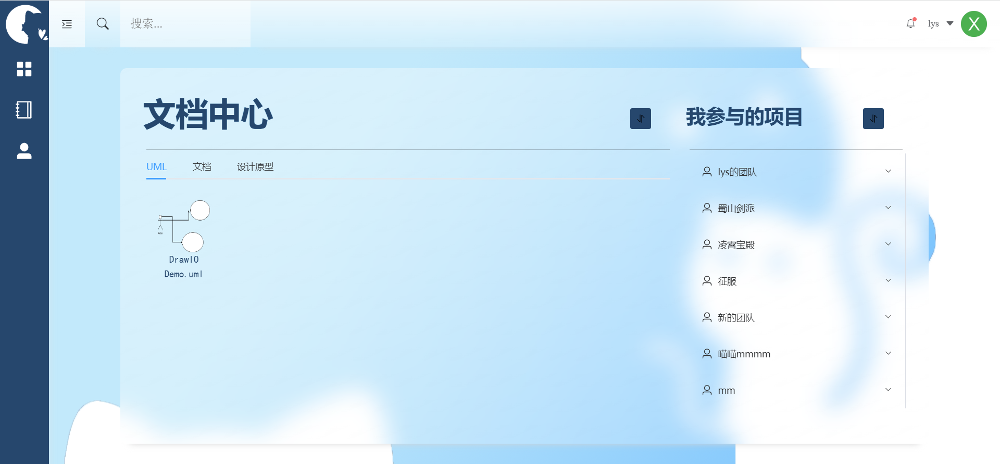
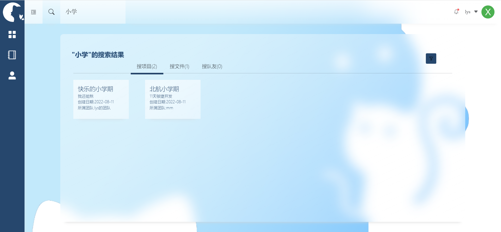
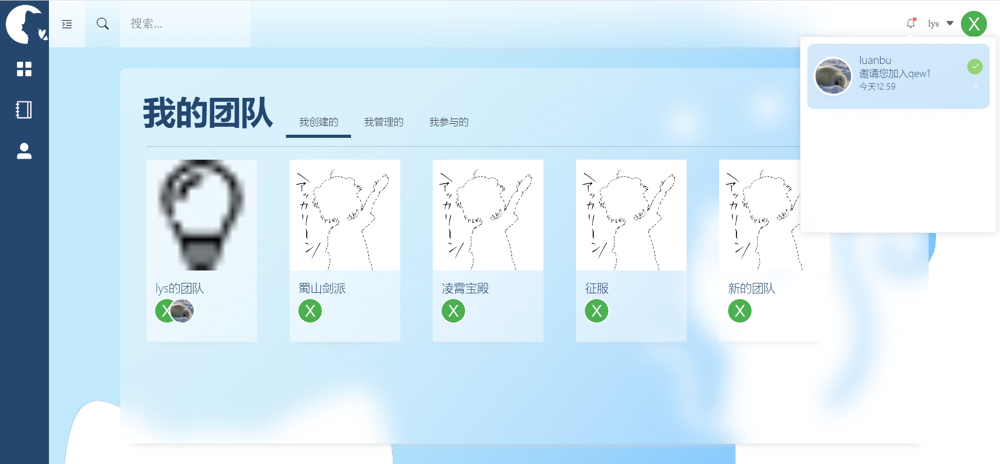

# nekopara1

## Infroduction

- 基于vue3和elementui的团队协作网站

- @BUAA2021软件工程实践2
- 11天时间6人敏捷开发
- vue+[django](https://github.com/nekopara-meow/backend)

## 🎄Demo

👉http://www.yaseal.space

## 📔Preview



## ✨Features

- 🎨 ElementuiPlus+Vue3.0 

- 💅多人协同编辑:[tiptap2.0](https://tiptap.dev/installation/vue3)

  由于版本兼容性问题编辑器最终半手搓，其实vue2的项目可以直接使用**[tiptap-vuetify](https://github.com/iliyaZelenko/tiptap-vuetify)** 开箱即用

  实时同步基于[yjs](https://github.com/yjs/yjs) 和 [y-webrtc](https://github.com/yjs/y-webrtc)

  

- 🔖原型设计：在线设计您自己的网页

  

- 📘内嵌[drawio-embed](https://imaoda.github.io/drawio-embed/) 支持绘制uml模型并且保存

  

- 🌐文件回收站/项目回收站

- 🎈工作台支持快速浏览项目文件

  

- 🍀搜索功能

  

- 💻消息通知

  

  

## 📦 Installation

### Project setup

```
npm install
```

### Compiles and hot-reloads for development

```
npm run serve
```

### Compiles and minifies for production

```
npm run build
```

### Customize configuration
